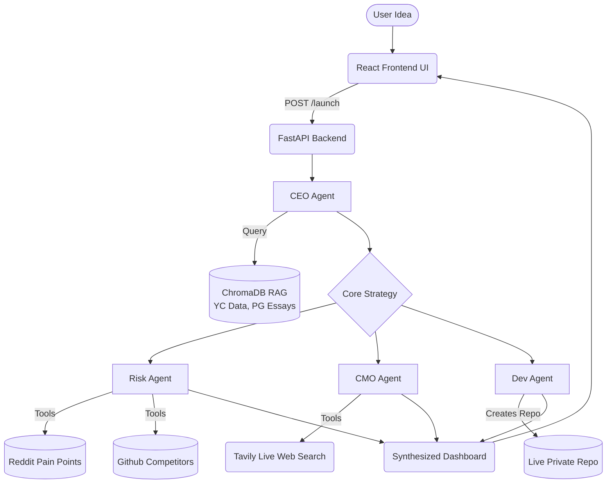

<div align="center">
  <h1>🚀 FoundrAI 2.0</h1>
  <p><strong>The Agentic AI Startup Accelerator & Simulator</strong></p>
  <p><i>Turn a single sentence into a fully validated, funded-ready startup pitch, architecture, and code repository in under 60 seconds.</i></p>
</div>

<br />

## 📖 Overview

**FoundrAI 2.0** is an autonomous multi-agent ecosystem designed to simulate an entire startup founding team. Instead of spending weeks validating an idea, researching the market, finding risks, and writing boilerplates, FoundrAI orchestrates a "Round Table" of specialized AI agents to interrogate, refine, and deploy your startup idea instantly.

Built entirely for the **Hack2Skills Hackathon**, this project demonstrates the power of autonomous agent communication, Retrieval-Augmented Generation (RAG), and Human-in-the-Loop deployments.

---

## ✨ Core Concepts

### 1. Multi-Agent Orchestration
FoundrAI moves beyond simple chatbots by establishing an **Agentic Round Table**. Specialized agents (CEO, Risk Manager, CMO) don't just output text—they engage in a sequence of dependent actions, using live tools, scraping the web, and challenging each other's assumptions to yield a bulletproof business plan.

### 2. Grounded Reasoning via RAG (ChromaDB)
To ensure the AI doesn't hallucinate generic advice, the system is grounded in a robust **Retrieval-Augmented Generation (RAG)** vector database using ChromaDB. Before the CEO speaks, it queries a embedded index of:
- *Paul Graham's Essays*
- *Y Combinator Startup Advice*
- *Successful Seed Pitch Decks*
- *Startup Failure Post-Mortems*

The agents speak with the combined wisdom of Silicon Valley's best operators.

### 3. "Hands" & Autonomy (Tool Use)
Our agents are equipped with "hands" (API Tools) to touch the real world:
- **Tavily AI Search**: Scrapes live internet data for competitor analysis.
- **GitHub Search**: Checks if similar open-source tools already exist.
- **Reddit Sentiment Analysis**: Queries localized demographic posts for actual customer pain points.
- **PyGithub Deployment**: The Developer agent autonomously initiates a Git repo and pushes boilerplate code.

---

## 🤖 The Founding Team (Agents)

| Agent | Role & Capabilities | Output |
| :--- | :--- | :--- |
| 👔 **The CEO (Vision & Strategy)** | Grounded by ChromaDB RAG. Acts as the orchestrator. Takes the raw idea and aligns it with YC principles. | `Pitch Deck & Core Value Proposition` |
| 🕵️ **Risk & Reality Check** | The ultimate skeptic. Uses Reddit semantic searches and GitHub API to find why the idea will fail or who has already built it. | `Risk Matrix & Mitigation Plan` |
| 📈 **Chief Marketing Officer** | Uses Tavily Search API to scan live competitor landing pages and keyword trends to find the blue-ocean GTM strategy. | `Go-to-Market (GTM) & Growth Loop` |
| 💻 **Lead Developer (Autonomy)** | Doesn't just write code—it acts. Given the final plan, it generates an architecture, a `docker-compose.yml`, and uses GitHub to autonomously commit the boilerplate. | `Live GitHub Repository & Tech Stack` |

---

## 🏗 System Architecture 



---

## 🛠 Tech Stack

*   **Frontend**: React, Vite, Vanilla CSS (Custom modern dark-theme tokens, glassmorphism UI, complex asynchronous states).
*   **Backend**: Python, FastAPI, Uvicorn (Fully async API routing).
*   **Agentic Framework**: Custom LLM Orchestrator parsing tool-calls and multi-agent loops.
*   **LLM Provider**: Hugging Face Inference API (`meta-llama`), optimizing local compute. 
*   **Vector Database**: ChromaDB (Idempotent local SQLite + HuggingFace Embeddings API `all-MiniLM-L6`).
*   **Infrastructure**: Docker + Docker Compose (Isolated, multi-container deployment).
*   **External APIs**: Tavily (Search), PyGithub (Deployment), standard `requests`.

---

## 🚀 How to Run Locally

### Prerequisites
- Docker and Docker Compose
- A Hugging Face Token (`HF_TOKEN`)
- A Tavily API Key (`TAVILY_API_KEY`)
- A GitHub Classic PAT token with repo scopes (`GITHUB_TOKEN`)

### Setup

1. **Clone the repository:**
   ```bash
   git clone https://github.com/your-username/FoundrAI2_0.git
   cd FoundrAI2_0
   ```

2. **Configure Environment Variables:**
   You must set up your API keys before running the accelerator.
   Go into the `/backend` directory and copy the placeholder file:
   ```bash
   cd backend
   cp .env.example .env
   ```
   Then open `.env` and **replace the placeholders** with your actual API keys:
   ```env
   HF_TOKEN=your_real_huggingface_token
   TAVILY_API_KEY=your_real_tavily_token
   GITHUB_TOKEN=your_real_github_token
   ```

3. **Deploy the Stack via Docker:**
   FoundrAI uses Docker Compose to manage both the React frontend and the RAG-enabled Python backend.
   ```bash
   docker compose up -d --build
   ```

4. **Launch the Accelerator:**
   Open `http://localhost:5173` in your browser. Enter a startup idea, and watch your founding team go to work.

---
<div align="center">
  <i>Built with ❤️ for the Hack2Skills Hackathon.</i>
</div>
